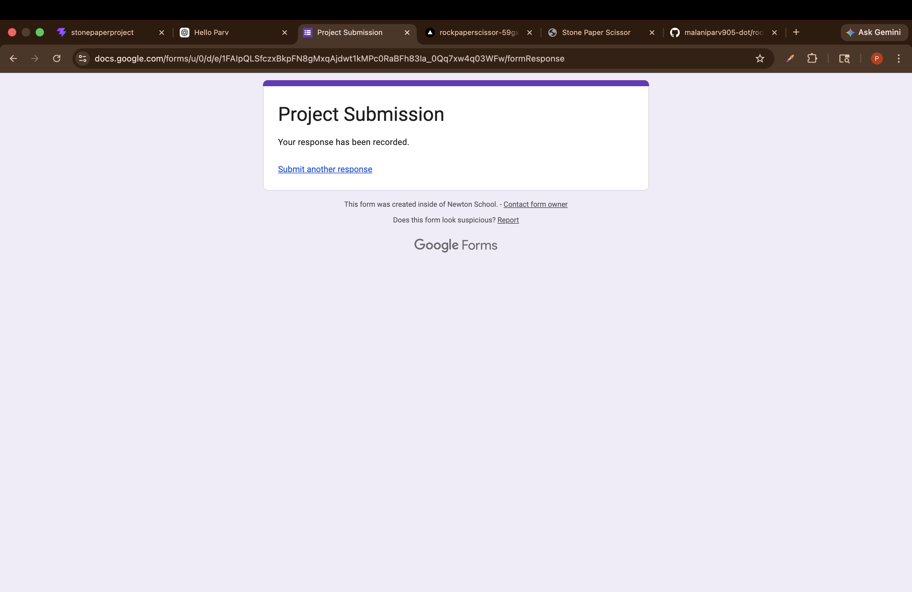

# 🍿 Movie Explorer

A premium, modular web application built for film enthusiasts to search, discover, and organize movies. Powered by the **OMDb API**, Movie Explorer combines a beautiful, glassmorphic UI with dynamic content loading.



## ✨ Key Features

- **Dynamic Search & Discovery**: Instantly search for any movie to see ratings, posters, and summaries.
- **Genre-Specific Modules**: A modular codebase architecture dynamically themes and scopes content by genres (Action, Thriller, Comedy, Sci-Fi, Horror, Romance).
- **Personal Library**: "Like" movies to build your personal watchlist which saves across sessions.
- **Detailed Modals**: Click into any movie card to reveal an expansive overlay containing the full plot, cast, director, languages, and IMDb rating.
- **Advanced Filtering & Sorting**: Filter by specific genres and sort your results by Release Year (Newest/Oldest) or alphabetically.
- **Dark/Light Theme Toggle**: Full support for both a sleek dark mode and a clean light mode layout.
- **Responsive Layout**: Designed to work beautifully on desktops, tablets, and mobile devices.

---

## 🛠 Technologies Used

- **HTML5**: Semantic document structure.
- **CSS3**: Vanilla CSS featuring CSS Grid, Flexbox, Custom Properties (Variables), and Glassmorphism techniques (backdrop-filter).
- **JavaScript (ES6+)**: Modular vanilla JS to handle API fetching, state management (Favorites/Current Movies), and dynamic DOM manipulation.
- **OMDb API**: The central data source providing all movie metadata.

---

## 🚀 Getting Started

To run this project locally, no complicated build tools or frameworks are required.

1. **Clone the repository**:
   ```bash
   git clone https://github.com/malaniparv905-dot/MOVIE-EXPLORER.git
   cd MOVIE-EXPLORER
   ```

2. **Run a local server**:
   Because the app utilizes modules and API fetching, you must serve it over HTTP (opening the HTML file directly via `file://` may trigger CORS/module errors). You can easily start a server using Python:
   ```bash
   python3 -m http.server 8000
   ```
   Or using Node.js/npx:
   ```bash
   npx serve .
   ```

3. **Open your browser**:
   Visit [http://localhost:8000](http://localhost:8000)

---

## 🏗 Modular Architecture

The application is heavily modular to keep styles and logic isolated, particularly for genre-specific UI elements. 

```text
📦 MOVIE-EXPLORER
 ┣ 📂 css
 ┃ ┣ 📜 action.css
 ┃ ┣ 📜 comedy.css
 ┃ ┣ 📜 horror.css
 ┃ ┣ 📜 romance.css
 ┃ ┣ 📜 scifi.css
 ┃ ┗ 📜 thriller.css
 ┣ 📂 js
 ┃ ┣ 📜 action.js
 ┃ ┣ 📜 comedy.js
 ┃ ┣ 📜 home.js
 ┃ ┣ 📜 horror.js
 ┃ ┣ 📜 romance.js
 ┃ ┣ 📜 scifi.js
 ┃ ┗ 📜 thriller.js
 ┣ 📜 index.html
 ┣ 📜 main.js
 ┗ 📜 style.css
```

Each genre has its own `.css` for theme rules (like background tints) and `.js` file to supply unique, dynamic initial searches when accessing a category.

---

## 🔌 API Integration

This app utilizes the [OMDb API](https://www.omdbapi.com/). A free API key is embedded by default. When performing queries, the application fetches results in pages (handling append-style "Load More" dynamically) and fetches full descriptions asynchronously for detailed views.

---

*Built beautifully with modern web standards.*
